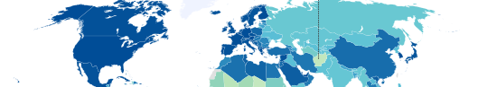
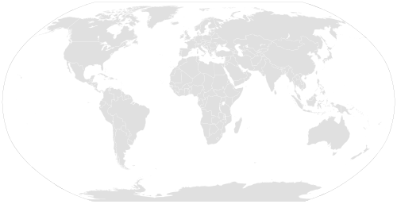
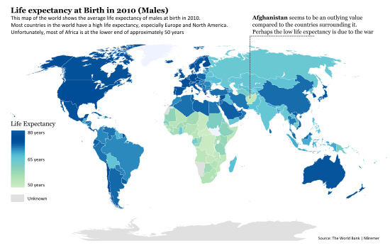

# Showing Life Expectancy around the World

###### Using R to turn a grey World into one filled with colors
> http://www.visualcinnamon.com/2013/03/showing-life-expectancy-around-world.html
> **Tags:** Open data, R, SVG



I started reading the book “Visualize This” by Nathan Yau who also has an excellent website called FlowingData. I loved the fact that the coding examples are very detailed, really making it possible to recreate whatever figure appears in the book.

I couldn’t wait to try several of his examples myself, but the SVG World Map is my favorite so that’s where I started. I downloaded the SVG map of the World from the wiki page http://en.wikipedia.org/wiki/Wikipedia:Blank_maps called ``BlankMap-World6.svg``. Since it’s an SVG I opened it in Notepad++ to get a feel for the structure of the file

The map from Wiki is still completely grey, but thanks to the XML/HTML style of the SVG (and Nathan’s explanation) I can create CSS classes per country (the polygons of each country uses the alpha-2 country code as a class id)



To avoid being a complete copy cat, I chose a different dataset than the book, which looks at the percentages of urban population with access to an improved water source. Instead, I was already playing around with the Life Expectancy of Males at Birth, still from the World Bank website, for a QlikView extension.
Also, since I was already playing around with the data, I had added the official ISO 3166-1 alpha-2 country codes to the data in a previous stage. The World Bank uses the alpha-3 codes, however, the classes per polygon in the ``BlankMap-World6.svg`` uses the alpha-2.
In his book he discusses how to use Python to calculate a color per country, depending on the value of water access, in ~7 color bins. I actually wanted to use a more continuous color scale, and since my favorite programming language is R, I wanted to see if I could follow similar steps in R.
I used the designer.colors function in R (in the fields package) to make a linear scale of 256 ‘new’ colors between the 6 colors that are used in Nathan’s example. I know, 256 is a bit much, but its my default for this function :)

```R
Ncolors <- 256
ColRamp <- designer.colors(n=Ncolors, col=c("#CCEBC5", "#A8DDB5", "#7BCCC4", "#4EB3D3", "#08589E", "#08589E"))
```

Next, I divided the range between the minimum (~50) and maximum age (~80) into 256 evenly spaced bins and for each country (and therefore life expectancy) calculated in what bin number it would belong. The median age of 65 would therefore lie approximately in bin 128. The color that corresponds to this age would be the 128th entry of the ColRamp vector.

```R
#Set up the vector that will save the CSS code per country
CSS <- rep("", length(lifeExpectancy2010))
#Divide the range of Life Expectancy in Ncolor bins
Bins <- seq(min(lifeExpectancy2010, na.rm=TRUE), max(lifeExpectancy2010, na.rm=TRUE),
length=Ncolors)
#Loop through all countries and find the corresponding color. Save the CSS text in a vector
for (i in 1:length(lifeExpectancy2010)) {
  #Find which Bin is closest to the value of Life Expectancy
  ColorCode <- ifelse(!is.na(lifeExpectancy2010[i]), ColRamp[which.min(abs(Bins-
  lifeExpectancy2010[i]))], "#EFF3FF")
  #Country.ID is the alpha-2 country code
  CSS[i] <- paste(".", tolower(Country.ID[i]) , " { fill: ", ColorCode, " }", sep="")
}#for i
```

The CSS itself looks like this

```css
.af { fill: #C2E7BE }
.al { fill: #06559C }
```

Finally, I saved the new CSS vector as a file (without row or column names) and pasted all the text into the boring grey BlankMap-World6.svg somewhere between the ``<style>`` and ``</style>``. That’s it! Now I can open the svg and look at a beautifully colored map showing me how Life Expectancy differs per country and continent
Again taking the advice from Nathan I used Inkscape to add some titles and text to the svg and added a Legend for the color range. The Legend is actually a second basic plot I created in R, using the ColRamp to plot a sequence of Ncolor blocks, saved as a PDF, opened in Inkscape and pasted into the world map.

```R
plot(rep(1,Ncolors), c(1:Ncolors), col=ColRamp, pch=15, cex=4)
```

See the result below for the final example of the Life Expectancy for Males at Birth in 2010


