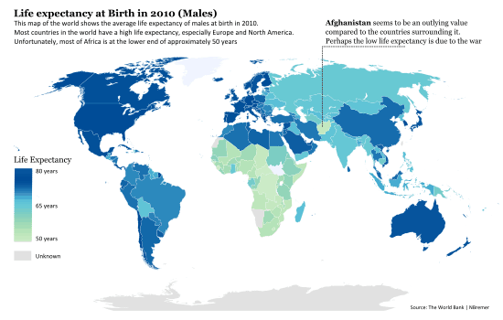
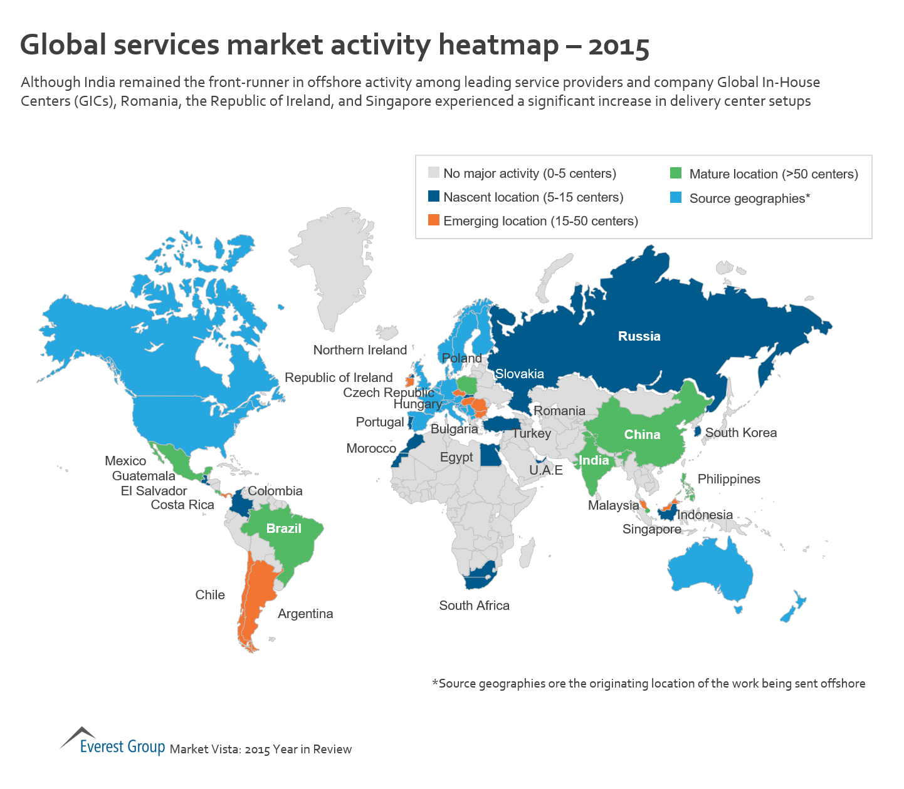

# Data.GIS 

[](https://doi.org/10.5281/zenodo.160130)

Data visualization for the information about and appraisal of an epidemic or human population genetics data associated with GIS data by using VisualBasic language hybrids with SVG/CSS.





###### Developer Note

For start the further development, install the Microsoft VisualBasic CLI runtime first:

```bash
PM> Install-Package VB_AppFramework
```

and then add reference to the dll files:

+ Microsoft.VisualBasic.Architecture.Framework_v3.0_22.0.76.201__8da45dcd8060cc9a.dll
+ Microsoft.VisualBasic.Data.Csv.dll
+ Microsoft.VisualBasic.Imaging.dll
+ Microsoft.VisualBasic.MIME.Markup.dll
