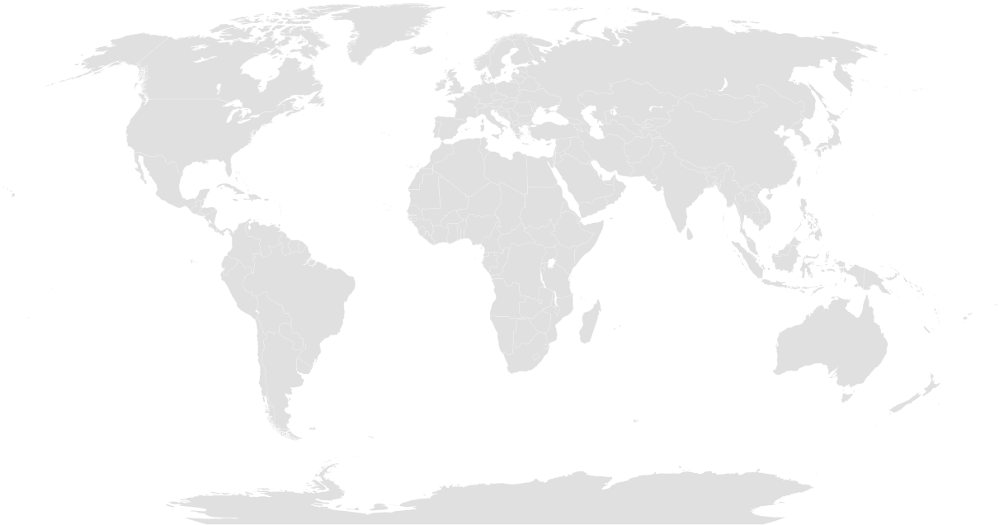

### BlankMap-World6.svg: Robinson projection, national borders, areas grouped.

> https://en.wikipedia.org/wiki/Wikipedia:Blank_maps#/media/File:BlankMap-World6.svg

A detailed Robinson projection SVG map with grouping enabled to connect all non-contiguous parts of a country's territory for easy colouring. Smaller countries can also be represented by larger circles to show their data easier. A thorough description of use and other instructions relating to can be found on the [instruction page](https://commons.wikimedia.org/wiki/File_talk:BlankMap-World6.svg/Documentation).

Adapted from Brianski's File:BlankMap-World3.svg by Canuckguy and originally based on CIA's political world map
